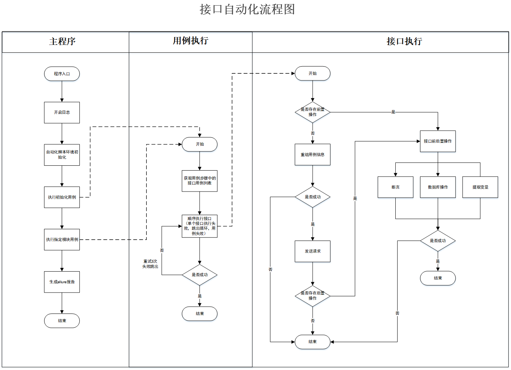

# 接口自动化:python+pytest+yaml+allure

## 流程图


## 目录结构
```
├── ApiData                           // 接口基本信息及测试数据（各个接口用例之间不存在调用情况）
    ├── bms                         
    ├── ...                    
├── common                           // 公共方法
    └── basefunc.py                  //基础方法
    └── checkresult.py               //断言
    └── database.py                  //数据库操作
    └── encryption.py                //加密
    └── exceptions.py                //异常处理
    └── extract.py                   //处理参数传递
    └── handleallure.py              //allure处理
    └── handledict.py                //字典处理
    └── handleyaml.py                //yaml文件处理
    └── logger.py                    //日志处理
    └── readcase.py                  //处理用例数据
    └── regroupdata.py               //用例重组
    └── relevancecase.py             //关联用例处理
    └── runcase.py                   //执行用例
    └── teardowncase.py              //后置用例处理
├── config                          // 配置
    └── __init__.py               
    └── config.yml                  //基础配置
    └── logging.yaml                //日志配置
├── files                          // 文件
├── logs                           // 日志
├── report                         // 测试报告
    └── report                      //测试报告
    └── tmp                         //临时文件
├── testcases                       //测试用例层
    ├── base                        //基础用例，统一平台基础初始化用例，每个用例执行前必执行
        └── useradd.yaml            //新增用户
    ├── bms   
        ├── smokecase                //冒烟用例
        ├── ...                
    ├── dlp
    ├── scma
    ├── ...
    └── test_cases.py             //执行用例
    └── conftest.py                //全局前置操作，主要为了解决token问题
    └── extract.yaml                //参数传递文件
    └── case_ceshi.py                //接口自测
├── Readme.md                       
├── pytest.ini                   
├── excute.py                       // 运行入口  
├── requirements.txt                            
```
## 接口yaml结构

```
# 接口ID
user_group_list:
  # 接口基本信息
  ApiInfo:
    # 基础URL:https://192.168.148.174:31000
    base_url: ${base_url}
    # 请求信息
    request:
      # 请求类型
      method: GET
      # 请求地址
      address: /api/user/v1/querygroups/1
      # 请求头
      headers:
        Content-Type: application/json
        token: ${token}
        Referer: ${base_url}/sub-app-unity/group
  # 接口用例，填写接口发送数据、前置操作、后置操作，发送请求时将接口基本信息与接口数据组合
  ApiData:
    # 接口用例ID
    user_group_list_01:
      # 接口用例名称
      name: 搜索一级组织机构下特定用户组信息
      # 接口用例描述
      description: 搜索一级组织机构下特定用户组信息
      # 请求信息，包括data，file
      request:
        # 请求数据
        data:
          groupName: 自动化测试根组
          page: 1
          rows: 20
      # 后置操作
      postProcessors:
        # 断言
        assert:
          # 状态码校验
          code: 200
          # 返回值校验
          response: { "statusCode": 0,"msg": "success" }
          # jsonpath校验
          jsonpath:
            - path: $.data[0].groupName
              value: 自动化测试根组
              type: in
#        # 数据库校验
#        dbcheck:
#          - type: mysql
#            sql: select * from `bms-general-aa`.t_sys_role tsr where roleName = '自动化测试角色'
#            result:
#              - path: $.roleName
#                value: 自动化测试角色
        # 提取变量
        extract:
          - name: groupId     #变量名称
            # jsonpath表达式
            jsonpath: $.data[0].groupId
```
## 取值方式
1. 参数取值：${}
2. 时间取值: $GetTime()
   - 获取当前时间，指定格式：$GetTime(format=%Y-%m-%d %H:%M:%S)
   - 获取当前时间，时间偏移：$GetTime(format=%Y-%m-%d %H:%M:%S;cal=m+1)
     - +：向后偏移；-：向前偏移
     - w：周偏移；d：天偏移；h：小时偏移；m：分钟偏移
3. 公式计算
   - 取值后，进行公示计算：$Eval(${};cal=+1)
   - 取值后，转换格式，根据jsonpath获取指定值：$Eval(${};path=)  
      （针对获取的值为字符串，需要获取字符串中的特定参数的场景）
